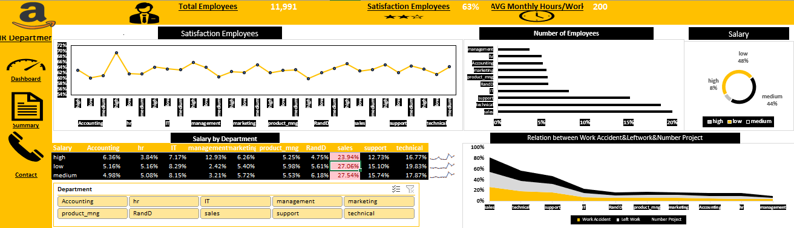

# Amazon
# 🏢 Amazon Employee Analysis Dashboard

This project analyzes **Amazon employee satisfaction, salary distribution, and department performance** using HR dataset insights.

---

## 📊 Project Overview
The goal of this analysis is to identify:
- Which departments have **low satisfaction** levels.
- The **salary distribution** across departments.
- The relationship between **work accidents, left employees, and number of projects**.
- The **average monthly working hours** and overall **employee satisfaction**.

---

## 📈 Key Insights

### 🔹 Total Employees
**11,991 employees** across all departments.

### 🔹 Average Employee Satisfaction
Overall satisfaction: **63%** ⭐⭐⭐☆

### 🔹 Average Monthly Hours
Employees work an average of **200 hours/month**.

### 🔹 Salary Distribution
| Salary Level | Percentage |
|---------------|-------------|
| High          | 8%          |
| Medium        | 44%         |
| Low           | 48%         |

The majority of employees are in the **low to medium** salary categories.

---

## 🧠 Department-Level Insights

| Department | Low Salary | Medium Salary | High Salary | Key Notes |
|-------------|-------------|----------------|--------------|------------|
| Accounting | 5.16% | 5.08% | 6.36% | Stable satisfaction |
| HR | 5.16% | 8.15% | 7.17% | Slightly higher satisfaction |
| Management | 2.42% | 3.21% | 12.93% | High salary proportion |
| Marketing | 6.26% | 5.72% | 6.26% | Moderate satisfaction |
| Product Management | 5.61% | 5.53% | 5.25% | Consistent salaries |
| R&D | 27.06% | 6.18% | 15.10% | High employee turnover |
| Sales | 23.94% | 27.54% | 15.10% | Needs improvement |
| Support | 12.73% | 15.74% | 12.73% | Medium satisfaction |
| Technical | 16.77% | 17.87% | 16.77% | Balanced performance |

---

## ⚙️ Tools Used
- **Power BI**: For dashboard visualization  
- **Excel / CSV**: Data source  
- **GitHub**: Project hosting  

---

## 📌 Observations
- Departments with **higher accident rates** tend to have **lower satisfaction**.
- **Sales and R&D** have the **highest employee turnover**.
- **Management** has the **highest salary levels** and better satisfaction.
- Work-life balance issues appear to correlate with **average monthly hours**.

---

## 📷 Dashboard Preview

---

## 🧩 Future Improvements
- Add time-based trend analysis.
- Include predictive analytics for employee churn.
- Develop automated HR reporting pipelines.

---

## ✍️ Author
**Mohamed Tohamy**  
📧 [Your Email or LinkedIn Link]  
📊 Data Analyst | Power BI | Excel | Python  
